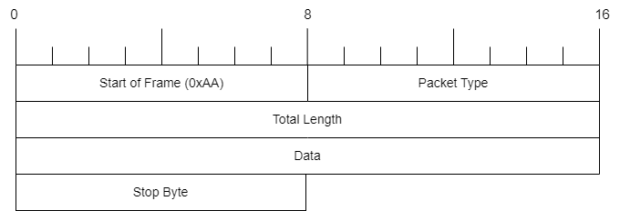

# UART PROTOCOL
### Frame of Protocol
**Frame**
    **START BYTE** - **PACKET TYPE** - **TOTAL LENGTH** - **DATA** - **STOP BYTE**
- **Start Byte** : marks the beginning of the frame.
- **Header** : including Packet type and Total length. 
- **Data** : the actual being transmitted. 
- **Stop Byte** : marks the end of the frame.

### Table of Contents
- [UART PROTOCOL](#uart-protocol)
    - [Frame of Protocol](#frame-of-protocol)
    - [Table of Contents](#table-of-contents)
    - [1. Start of frame](#1-start-of-frame)
    - [2. Packet type](#2-packet-type)
    - [3. Total length](#3-total-length)
    - [4. Data](#4-data)
    - [5. Stop of frame](#5-stop-of-frame)
    - [6. Example](#6-example)
### 1. Start of frame
Start byte (1 byte) : the begining of the frame **_default AA_**
### 2. Packet type
**2.1. Packet type (1 byte )**

| Packet Type      | Value | Description                    |
|------------------|-------|--------------------------------|
| MMV_CHECK_STATUS | 0x00  | Check UART status              |
| MMV_CHECK_SLOT   | 0x01  | Check current slot information |
| MMV_CHECK_TOTAL  | 0x02  | Check total cars entry and exit the parking lot                                             |
| MMV_CHECK_CONFIG | 0x03  | Check system configuration     |
| MMV_SET_FEE      | 0x04  | Set fee Ex data: 50000per1h                                                  |
| MMV_SET_TIME     | 0x05  | Set time Ex data: 10h15m20s 15dd10mm2024yy                                               |
| MMV_SET_ID       | 0x06  | Set new ID card Ex data: ID 123456789                                                   |
| MMV_RESET_SYS    | 0x07  | Reset system                   |

**2.2. Packet Response (1 byte)**

| Packet Respone   | Description                            |
|------------------|----------------------------------------|
| MMV_RESP_STATUS  | Used to respone UART status protocol   Ex data: STATUS OK! or STATUS ERROR                    |
| MMV_RESP_SLOT    | Used to respone the command check information about current slots be used in the parking lot Ex data: 12/16 used                                  |
| MMV_RESP_TOTAL   | Used to respone the command check total cars entry or exit the parking lot  Ex data: Entry: 30 Exit: 20                                                    |
| MMV_RESP_CONFIG  | Used to respone the command check system configuration, including: time, fee, parking lot number   Ex data: Time: 10h20m30s, 12/03/2024; Fee: 50000per1; Lot number: 20                                   |
| MMV_RESP_FEE     | Used to respone set fee status   Ex data: Set success 50000per1                                 |
|MMV_RESP_TIME     | Used to respone the command set time status   Ex data: Set success 20h10m15s 12/03/2024       |
| MMV_RESP_ID       | Used to respone the command set new ID card   Ex data: Set ID success 123456789                 |
| MMV_RESP_RESET   | Used to respone the command reset system   Ex data: Reset success or Reset failed          |

**2.3. Sequence Diagram**

### 3. Total length
Total lenght (2 byte) : Indicates the number of bytes in the data (not including header).
### 4. Data
Data (nbytes) : Data of packet type
### 5. Stop of frame
Stop byte ( 1 byte) : The end of the frame **_default 0x55_** 
### 6. Example
    AA0104abcd55
- Start byte : AA
- Packet type : 01
- Total length : 04
- Data : "abcd"
- Stop byte : 55